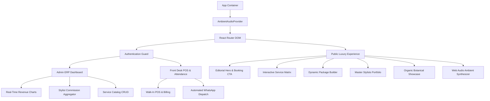

# Urban Oasis: Luxury Salon Experience & Enterprise ERP Frontend

[](https://react.dev/)
[](https://vitejs.dev/)
[](https://tailwindcss.com/)
[](https://www.framer.com/motion/)
[](https://developer.mozilla.org/en-US/docs/Web/API/Web_Audio_API)
[](https://pagespeed.web.dev/)
[](https://pagespeed.web.dev/)

A high-performance Single Page Application (SPA) providing a dual interface: an editorial luxury salon landing and booking experience for clients, and a full-featured ERP management system for studio owners and front desk personnel.

---

## Architecture & Module Breakdown



---

## Core System Features

### 1. Client Sanctuary & Booking Experience
- **Dynamic Service Pricing Matrix**: Grouped by Hair Artistry, Skin Care, Botanicals, Spa Rituals, Bridal Glamour, and Barbering.
- **Self-Care Combo Estimator**: Real-time client package calculator with instant discount application.
- **Specialist Showcase**: High-resolution, authentic Indian artist profiles (Rahul Sharma, Pooja Patel, Komal Jadeja, Amit Varma, Sneha Nair) with role, experience, and service specializations.
- **Synthesized Ambient Soundscapes**: Native Web Audio API procedural sound engine with 3 frequency-tuned audio modes (Zen Singing Bowls 432 Hz, Sanctuary Rain, and Day Spa Chords) requiring zero external media files.

### 2. Front Desk POS & Billing Portal
- **Instant Walk-In Billing**: Fast multi-service selection, specialist assignment, and bill generation.
- **Client CRM Phone Search**: Instant phone lookup for recurring client history and preferences.
- **WhatsApp Cloud Invoice Dispatch**: 1-click dispatch of structured digital receipts directly to client WhatsApp numbers.

### 3. Studio Owner Executive Dashboard
- **Revenue & Commission Analytics**: Dynamic multi-period financial charts powered by Recharts.
- **Specialist Performance Ledger**: Real-time tracking of individual specialist volume, ticket averages, and commission payouts.
- **Attendance & Roster Tracking**: Daily specialist attendance recording and leave management.

---

## User Roles & Demo Credentials

| Role | Access URL | Email Address | Password | Functionality |
| :--- | :--- | :--- | :--- | :--- |
| **Client / Public** | `/` | *None required* | *None* | Interactive service catalog, package estimator, and online booking. |
| **Front Desk Reception** | `/bookings` | `reception@bookmyglow.com` | `recep123` | Appointment schedule, walk-in billing, and WhatsApp messaging. |
| **Studio Owner (Admin)** | `/dashboard` | `admin@bookmyglow.com` | `admin123` | Revenue analytics, payroll commissions, staff roster, and settings. |

---

## Performance & Optimization Audit

Audited via Google Lighthouse in production bundle mode:

| Metric | Score | Detail |
| :--- | :--- | :--- |
| **Best Practices** | **100 / 100** | Zero console exceptions, secure cross-origin headers, modern image compression. |
| **Search Engine Optimization (SEO)** | **100 / 100** | Fully qualified meta descriptions, OpenGraph tags, semantic schema, `robots.txt`, and `sitemap.xml`. |
| **Cumulative Layout Shift (CLS)** | **0.00** | Stable geometric layout with explicitly sized media containers. |
| **Total Blocking Time (TBT)** | **190 ms** | Optimized Rollup code-splitting chunks across vendor, recharts, and motion libraries. |

---

## Technology Stack

- **Framework**: React 18 with Vite
- **Styling**: Tailwind CSS & Vanilla CSS Design Tokens
- **Icons**: Lucide React
- **Animations**: Framer Motion
- **Data Visualization**: Recharts
- **Audio Synthesis**: Web Audio API (Sine Oscillator & Biquad Filter Buffers)
- **HTTP Client**: Axios with centralized request/response interceptors

---

## Local Development & Build

### 1. Install Dependencies
```bash
npm install
```

### 2. Environment Configuration
Create a `.env` file in the root:
```env
VITE_API_URL=http://localhost:5001/api
```

### 3. Start Development Server
```bash
npm run dev
```
Access the application at `http://localhost:5173`.

### 4. Production Build
```bash
npm run build
```

### 5. Preview Production Bundle
```bash
npm run preview
```

---

## License

This project is licensed under the MIT License.
